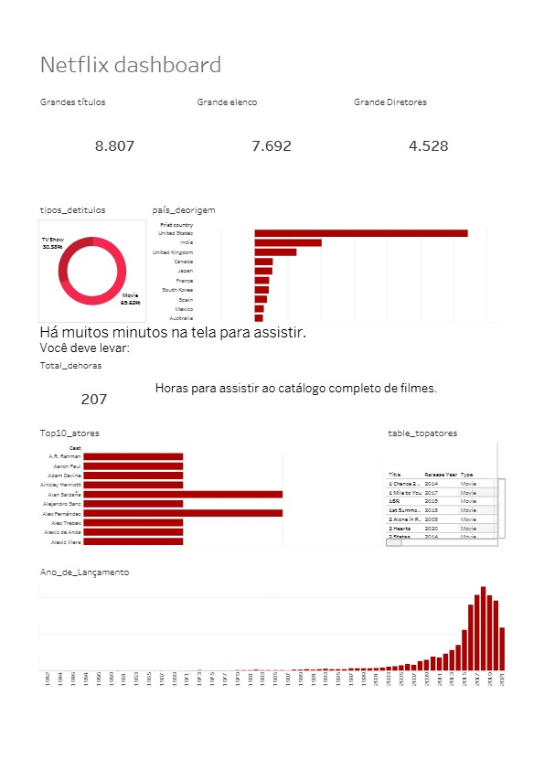

# Dashboard Netflix

Este projeto consiste na criação de um dashboard para a análise de dados relacionados à Netflix. O objetivo é fornecer insights valiosos sobre o desempenho de conteúdo, preferências dos usuários, e outras métricas relevantes.

## Descrição do Projeto

O projeto utiliza o Tableau para criar um dashboard interativo que permite aos usuários explorar e visualizar diferentes aspectos dos dados da Netflix. O arquivo principal do projeto é o `dashboardnetflix.twb`, que contém todas as visualizações e configurações necessárias para explorar os dados.

## Funcionalidades

- **Análise de Conteúdo**: Visualize o desempenho de filmes e séries na plataforma.
- **Preferências do Usuário**: Entenda as preferências dos usuários com base em gêneros, duração de conteúdo, e outras métricas.
- **Tendências Temporais**: Veja como as preferências e o consumo de conteúdo mudaram ao longo do tempo.

## Requisitos

- **Tableau**: Para abrir e interagir com o dashboard, você precisará ter o Tableau instalado em seu computador.

## Como Usar

1. Clone o repositório para o seu ambiente local.
   ```bash
   git clone https://github.com/Malu-luisa/Dashboard-Netflix.git 
   ```
## Dashboard Netflix 

   
